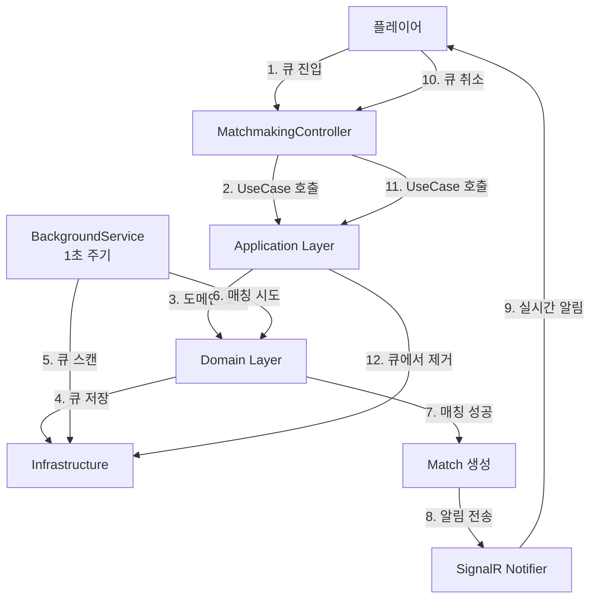
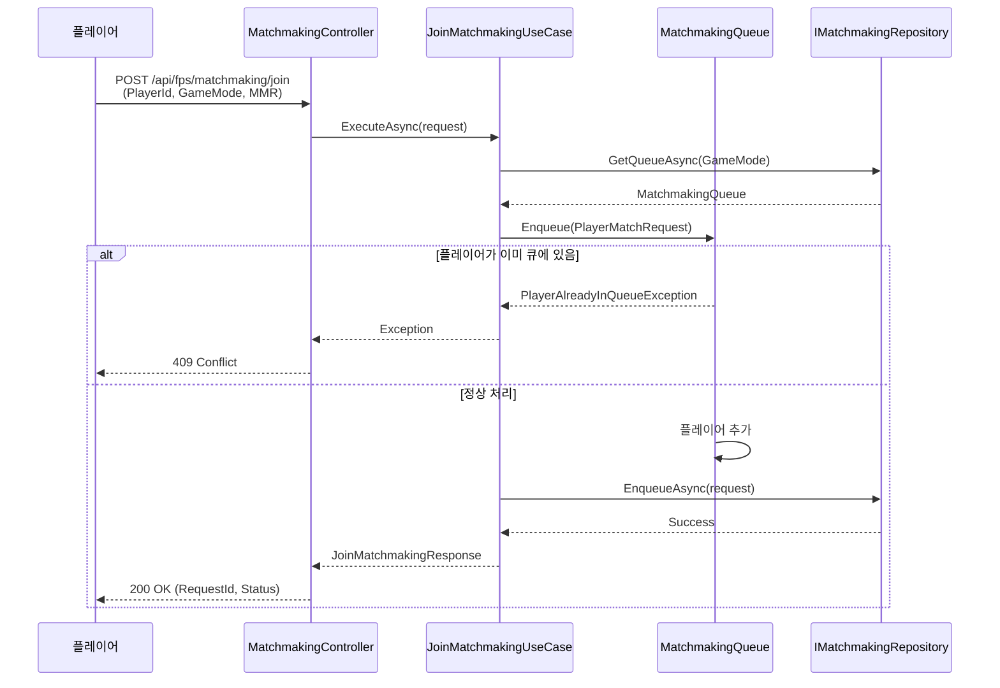
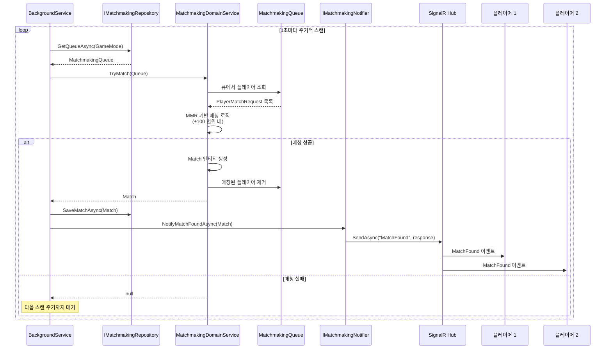
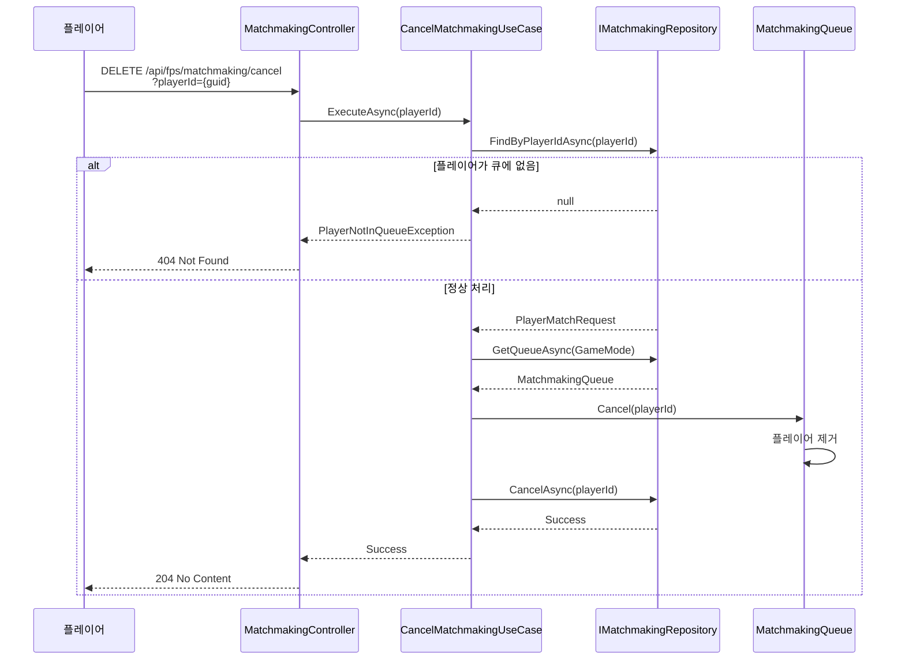
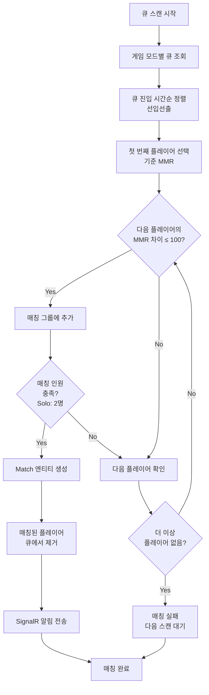

# 매치메이킹 시스템 상세 스펙

## 개요

본 문서는 ADR-0001에서 결정한 매치메이킹 시스템의 **상세 스펙 정의**를 제공합니다.  
구현 코드보다는 **무엇을 만들 것인가(What)**, **왜 만들 것인가(Why)**, **어떻게 동작할 것인가(How - 흐름 중심)**에 집중합니다.

## 참고 문서

- [ADR-0001: 매치메이킹 시스템 아키텍처 결정](../adr/0001-matchmaking-design.md)
- [아키텍처 가이드](../ARCHITECTURE.md)
- [컨벤션](../CONVENTIONS.md)

---

## 1. 목적 및 배경

### 1.1 목적

FPS 게임 서버에서 플레이어를 공정하게 매칭하여 게임 세션을 생성하는 핵심 기능을 제공합니다.

### 1.2 배경

- 실시간 게임 특성상 빠른 매칭(응답시간)이 중요
- 공정한 매칭을 위해 MMR(Matchmaking Rating) 기반 매칭 필요
- 확장성: 동시 다수의 매칭 요청 처리 가능해야 함

### 1.3 범위

**포함:**
- 플레이어 큐 진입/취소
- MMR 기반 매칭 알고리즘
- 매칭 성공 시 실시간 알림
- 게임 모드별 큐 관리 (Solo, Duo, Squad)

**제외 (MVP):**
- 매칭 이력 영속화 (확장 단계)
- Redis 기반 분산 큐 (확장 단계)
- 지역 기반 매칭 (확장 단계)

---

## 2. 유스케이스

### 2.0 전체 시스템 흐름 개요



### 2.1 큐 진입 (Join Matchmaking Queue)

**액터:** 플레이어 (클라이언트)

**전제조건:**
- 플레이어가 인증되어 있음
- 플레이어의 MMR 값이 존재함

**기본 흐름:**
1. 플레이어가 큐 진입 요청 (PlayerId, GameMode, MMR)
2. 시스템이 동일 플레이어의 중복 진입 여부 확인
3. 시스템이 게임 모드별 큐에 플레이어 추가
4. 시스템이 요청 ID와 상태 반환
5. 플레이어가 큐 대기 상태로 전환

**대안 흐름:**
- 2a. 플레이어가 이미 큐에 있는 경우 → 409 Conflict 반환
- 3a. 잘못된 게임 모드인 경우 → 400 Bad Request 반환

**사후조건:**
- 플레이어가 해당 게임 모드 큐에 등록됨
- 백그라운드 서비스가 주기적으로 매칭 시도 시작

**시퀀스 다이어그램:**



---

### 2.2 매칭 성공 (Match Found)

**액터:** 시스템 (백그라운드 서비스)

**전제조건:**
- 큐에 매칭 가능한 플레이어 그룹이 존재함

**기본 흐름:**
1. 백그라운드 서비스가 큐를 주기적으로 스캔 (1초 주기)
2. 시스템이 MMR 기반으로 매칭 가능한 플레이어 그룹 찾기
3. 매칭 성공 시 Match 엔티티 생성
4. 매칭된 플레이어들을 큐에서 제거
5. 시스템이 SignalR을 통해 매칭된 모든 플레이어에게 알림 전송
6. 플레이어들이 매칭 정보 수신 (MatchId, PlayerIds, GameMode)

**대안 흐름:**
- 2a. 매칭 가능한 그룹이 없는 경우 → 다음 스캔 주기까지 대기

**사후조건:**
- 매칭된 플레이어들이 큐에서 제거됨
- 매칭 정보가 모든 관련 플레이어에게 전달됨

**시퀀스 다이어그램:**



---

### 2.3 큐 취소 (Cancel Matchmaking)

**액터:** 플레이어 (클라이언트)

**전제조건:**
- 플레이어가 큐에 등록되어 있음

**기본 흐름:**
1. 플레이어가 큐 취소 요청 (PlayerId)
2. 시스템이 플레이어의 큐 등록 여부 확인
3. 시스템이 플레이어를 큐에서 제거
4. 시스템이 204 No Content 반환

**대안 흐름:**
- 2a. 플레이어가 큐에 없는 경우 → 404 Not Found 반환

**사후조건:**
- 플레이어가 큐에서 제거됨
- 백그라운드 서비스가 해당 플레이어를 매칭 대상에서 제외

**시퀀스 다이어그램:**



---

## 3. 기능 요구사항

### 3.1 큐 관리

**FR-001: 큐 진입**
- 플레이어는 게임 모드(Solo, Duo, Squad)를 선택하여 큐에 진입할 수 있어야 함
- 플레이어는 자신의 MMR 값을 포함하여 큐 진입 요청을 보낼 수 있어야 함
- 동일 플레이어의 중복 진입은 방지되어야 함
- 큐 진입 시 요청 ID와 상태를 반환해야 함

**FR-002: 큐 취소**
- 플레이어는 자신의 큐 진입을 취소할 수 있어야 함
- 큐에 없는 플레이어의 취소 요청은 적절한 에러를 반환해야 함

**FR-003: 큐 상태 조회 (선택)**
- 플레이어는 자신의 큐 상태를 조회할 수 있어야 함 (요청 ID, 게임 모드, 진입 시간, 상태)

### 3.2 매칭 알고리즘

**FR-004: MMR 기반 매칭**
- 매칭은 플레이어의 MMR 값을 기반으로 수행되어야 함
- MMR 차이가 허용 범위(±100) 내에 있는 플레이어들을 우선 매칭해야 함
- 매칭은 큐 진입 시간(선입선출)을 고려해야 함

**매칭 알고리즘 흐름:**



**FR-005: 게임 모드별 매칭**
- Solo 모드: 2명 매칭
- Duo 모드: 2팀(4명) 매칭 (향후 확장)
- Squad 모드: 2팀(8명) 매칭 (향후 확장)
- MVP는 Solo 모드만 지원

**FR-006: 주기적 매칭 시도**
- 백그라운드 서비스가 1초 주기로 큐를 스캔하여 매칭을 시도해야 함
- 매칭 성공 시 즉시 알림을 전송해야 함

### 3.3 알림

**FR-007: 실시간 알림**
- 매칭 성공 시 SignalR을 통해 관련 플레이어에게 실시간 알림을 전송해야 함
- 알림에는 MatchId, PlayerIds, GameMode, MatchedAt 정보가 포함되어야 함

---

## 4. 비기능 요구사항

### 4.1 성능

**NFR-001: 응답 시간**
- 큐 진입 요청 응답 시간: 100ms 이내 (P95)
- 큐 취소 요청 응답 시간: 50ms 이내 (P95)
- 매칭 성공 알림 전송 지연: 1초 이내 (백그라운드 스캔 주기)

**NFR-002: 처리량**
- 동시 큐 진입 요청: 1000 req/s 이상 처리 가능
- 동시 큐 관리: 10,000명 이상의 플레이어 큐 관리 가능

### 4.2 확장성

**NFR-003: 확장 가능한 구조**
- 메모리 기반 큐는 MVP 단계에서 사용하며, Redis 기반으로 전환 가능한 구조여야 함
- Port 인터페이스를 통해 구현체 교체가 용이해야 함

### 4.3 가용성

**NFR-004: 서버 재시작 대응**
- MVP 단계에서는 서버 재시작 시 큐 손실 허용
- 확장 단계에서는 Redis 기반 영속화로 큐 복구 가능

### 4.4 일관성

**NFR-005: 중복 매칭 방지**
- 동일 플레이어가 여러 매칭에 포함되지 않도록 보장해야 함
- 매칭 성공 시 즉시 큐에서 제거하여 중복 매칭 방지

---

## 5. 도메인 모델 개념

### 5.1 핵심 개념

**MatchmakingQueue (Aggregate Root)**
- 게임 모드별 큐를 관리하는 집합 루트
- 큐에 플레이어 추가/제거, 중복 진입 방지 등의 비즈니스 규칙 보장
- 상태: 큐에 등록된 플레이어 목록

**PlayerMatchRequest (엔티티)**
- 플레이어의 매칭 요청을 나타내는 엔티티
- 속성: RequestId, PlayerId, GameMode, PlayerMMR, EnqueuedAt
- 동일 플레이어의 중복 요청 방지 규칙 포함

**Match (엔티티)**
- 매칭 성공 결과를 나타내는 엔티티
- 속성: MatchId, GameMode, Players, MatchedAt
- 매칭된 플레이어 그룹 정보 포함

**MMR (값 객체)**
- Matchmaking Rating 값을 나타내는 불변 값 객체
- 속성: Value (int, 0 이상)
- Elo 레이팅 시스템 기반 (ADR-0003 참고)

**MatchmakingMode (열거형)**
- 게임 모드: Solo, Duo, Squad
- MVP는 Solo 모드만 지원

**MatchmakingDomainService (도메인 서비스)**
- 매칭 로직을 수행하는 도메인 서비스
- MMR 기반 매칭 알고리즘 구현
- 큐에서 매칭 가능한 플레이어 그룹 찾기

### 5.2 도메인 예외

- `MatchmakingException`: 매칭 관련 예외의 베이스 클래스
- `PlayerAlreadyInQueueException`: 플레이어가 이미 큐에 있는 경우
- `PlayerNotInQueueException`: 플레이어가 큐에 없는 경우
- `InvalidMatchmakingRequestException`: 잘못된 매칭 요청 (게임 모드 불일치 등)

---

## 6. API 스펙

### 6.1 REST 엔드포인트

#### POST /api/fps/matchmaking/join

**요청:**
```json
{
  "playerId": "guid",
  "gameMode": 1,
  "mmr": 1500
}
```

**응답 (성공):**
```json
{
  "requestId": "guid",
  "status": "Enqueued"
}
```

**응답 (에러):**
- 400 Bad Request: 잘못된 요청 (게임 모드 불일치 등)
- 409 Conflict: 플레이어가 이미 큐에 있음
- 500 Internal Server Error: 서버 오류

---

#### DELETE /api/fps/matchmaking/cancel

**요청:**
```
DELETE /api/fps/matchmaking/cancel?playerId={guid}
```

**응답 (성공):**
- 204 No Content

**응답 (에러):**
- 404 Not Found: 플레이어가 큐에 없음
- 500 Internal Server Error: 서버 오류

---

#### GET /api/fps/matchmaking/status (선택)

**요청:**
```
GET /api/fps/matchmaking/status?playerId={guid}
```

**응답 (성공):**
```json
{
  "requestId": "guid",
  "gameMode": 1,
  "enqueuedAt": "2025-11-08T10:00:00Z",
  "status": "Waiting"
}
```

**응답 (에러):**
- 404 Not Found: 플레이어가 큐에 없음

---

### 6.2 SignalR Hub

**Hub 이름:** `MatchmakingHub`

**연결:**
- 클라이언트는 SignalR Hub에 연결하여 매칭 알림을 수신

**이벤트: MatchFound**

**메시지 형식:**
```json
{
  "matchId": "guid",
  "gameMode": 1,
  "playerIds": ["guid1", "guid2"],
  "matchedAt": "2025-11-08T10:00:00Z"
}
```

**전송 시점:**
- 매칭 성공 시 매칭된 모든 플레이어에게 전송

---

## 7. 제약사항

### 7.1 기술적 제약

**C-001: 메모리 기반 큐**
- MVP는 메모리 기반 큐만 지원
- 서버 재시작 시 큐 손실 발생
- 단일 서버 인스턴스에서만 동작

**C-002: MMR 값**
- MMR은 0 이상의 정수 값
- Elo 레이팅 시스템 기반 (ADR-0003 참고)
- MMR 계산은 별도 시스템(매치 세션 종료 시)에서 수행

**C-003: 매칭 주기**
- 백그라운드 서비스가 1초 주기로 스캔
- 최대 매칭 지연: 1초 (스캔 주기)

### 7.2 비즈니스 제약

**C-004: 게임 모드**
- MVP는 Solo 모드만 지원
- Duo, Squad 모드는 확장 단계에서 구현

**C-005: 매칭 인원**
- Solo 모드: 2명 매칭
- 팀 매칭은 확장 단계에서 구현

---

## 8. 성능 및 확장성 고려사항

### 8.1 현재 (MVP)

- 메모리 기반 큐: 빠른 응답 시간, 단순한 구조
- 주기적 스캔: 1초 주기로 충분한 매칭 성공률
- 단일 서버: 수천 명 규모의 동시 큐 관리 가능

### 8.2 확장 계획

**Redis 기반 큐 전환**
- 분산 환경에서 동작 가능
- 서버 재시작 시 큐 복구 가능
- 수만 명 규모의 동시 큐 관리 가능

**매칭 알고리즘 개선**
- MMR 허용 범위 동적 조정 (대기 시간에 따라 확장)
- 지역 기반 매칭 (지연 시간 고려)
- 팀 밸런스 고려 (듀오/스쿼드 모드)

**매칭 이력 저장**
- Match 엔티티를 DB에 영속화
- 통계 및 분석을 위한 데이터 수집

---

## 9. 구현 순서

### 9.1 레이어별 구현 순서

1. **Domain 레이어** (#16)
   - 도메인 모델 (MMR, MatchmakingQueue, Match, PlayerMatchRequest)
   - 도메인 서비스 (MatchmakingDomainService)
   - 도메인 예외

2. **Application 레이어** (#17)
   - Port 인터페이스 (IMatchmakingRepository, IMatchmakingNotifier)
   - UseCase (JoinMatchmakingQueueUseCase, CancelMatchmakingUseCase)
   - DTO 및 Mapper

3. **Infrastructure 레이어** (#19)
   - InMemoryMatchmakingRepository
   - SignalRMatchmakingNotifier
   - MatchmakingBackgroundService
   - DI 확장 메서드

4. **API 레이어** (#18)
   - MatchmakingController
   - MatchmakingHub
   - 입력 검증
   - DI 설정

### 9.2 테스트 전략

- **Domain 레이어**: 단위 테스트 (70%+ 커버리지)
- **Application 레이어**: Mock 기반 단위 테스트
- **API 레이어**: 통합 테스트 (WebApplicationFactory)
- **Infrastructure 레이어**: 통합 테스트 (선택)

---

## 10. 참고

- 관련 이슈: #16, #17, #18, #19
- 마일스톤: 0.3.0 (Matchmaking Implementation)
- ADR: [ADR-0001](../adr/0001-matchmaking-design.md)
